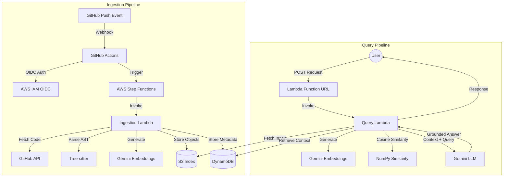

# RepoMind

<div align="center">

*A Cloud-Native, Event-Driven AWS Pipeline for Code-Aware Repository Q&A*

[](https://opensource.org/licenses/MIT)
[](https://www.python.org/downloads/)
[]()

</div>

---

## 📖 Overview

**RepoMind** is a cloud-native, event-driven Retrieval-Augmented Generation (RAG) system built on AWS. It allows developers to perform natural language Q&A over GitHub repositories, providing source-grounded answers based on the actual codebase. By leveraging code-aware AST (Abstract Syntax Tree) parsing, RepoMind understands the structure of code rather than treating it merely as text.

## 🎯 Problem Statement

Comprehending large codebases is time-consuming. Developers frequently spend hours tracing logic, hunting down dependencies, and answering repetitive questions during onboarding or debugging. While commercial "code chat" tools exist, they are often expensive, closed-source, and not easily self-deployable. RepoMind provides an accessible, $0/month target cost alternative designed for developers who want a powerful, private, and deployable code-Q&A tool.

## 🏗️ Architecture



## ✨ Features

- **Code-Aware AST Chunking:** Uses Tree-sitter to parse syntax trees, ensuring contextually relevant code chunks (functions, classes, etc.).
- **Incremental Indexing:** Efficiently handles file additions, modifications, deletions, and skips unmodified files to reduce API usage.
- **Source-Grounded Answers:** Responses include specific file, symbol, and line references.
- **Hallucination Prevention:** Prompts and context mechanisms are designed to anchor LLM responses strictly to the codebase.
- **Public & Private Repository Support:** Integrates seamlessly via GitHub Tokens.
- **Event-Driven Serverless Architecture:** Fully scalable, stateless AWS backend.
- **$0/Month Target Cost:** Optimized to run within the AWS and Gemini free tiers.

## ☁️ AWS Services Used

- **AWS Lambda:** Compute for ingestion and query processing.
- **AWS Step Functions:** Orchestration for ingestion pipelines.
- **Amazon S3:** Storing chunk indexes and vector data.
- **Amazon DynamoDB:** Metadata and file state tracking.
- **Amazon CloudWatch:** Logging and monitoring.
- **AWS Systems Manager (SSM) Parameter Store:** Secure secret management.
- **AWS IAM:** Roles, policies, and OIDC identity federation.
- **Lambda Function URL:** Lightweight HTTP endpoint for querying.

## 🛠️ Tech Stack

- **Language:** Python 3.13
- **Infrastructure as Code:** Terraform
- **CI/CD:** GitHub Actions
- **Parsing:** Tree-sitter (for various programming languages)
- **AI/LLM:** Gemini API (Free Tier)
- **Math/Vector Ops:** NumPy

## 📂 Project Structure

```text
CCD_Project/
├── .github/
│   └── workflows/
├── docs/
├── infrastructure/
│   ├── main.tf
│   ├── variables.tf
│   └── ...
├── src/
│   ├── ingestion/
│   ├── query/
│   └── shared/
├── tests/
├── README.md
├── requirements.txt
└── requirements-dev.txt
```

## 🚀 Setup & Installation

### Prerequisites
- [AWS CLI](https://aws.amazon.com/cli/) configured
- [Terraform](https://www.terraform.io/downloads)
- [Python 3.13+](https://www.python.org/downloads/)
- [GitHub CLI](https://cli.github.com/)
- [Node.js](https://nodejs.org/) (for some GitHub Actions dependencies)

### Installation Steps

1. **Clone the repository:**
   ```bash
   git clone https://github.com/mokshbalaji07/RepoMind.git
   cd RepoMind
   ```

2. **Install development dependencies:**
   ```bash
   python -m venv .venv
   source .venv/bin/activate  # On Windows: .venv\Scripts\activate
   pip install -r requirements-dev.txt
   ```

3. **Configure AWS CLI:**
   ```bash
   aws configure
   # Set region to ap-south-1
   ```

## 🔐 Secret Configuration

RepoMind uses AWS SSM Parameter Store to securely manage API keys.
**Note:** Never commit actual secrets or keys to version control.

Set up the following SecureString parameters in AWS (e.g., using the AWS CLI or Console):

- `/repomind/prod/gemini-api-key`
- `/repomind/prod/github-token`

Example using AWS CLI (with placeholder values):
```bash
aws ssm put-parameter \
    --name "/repomind/prod/gemini-api-key" \
    --value "YOUR_GEMINI_API_KEY_HERE" \
    --type "SecureString"

aws ssm put-parameter \
    --name "/repomind/prod/github-token" \
    --value "YOUR_GITHUB_TOKEN_HERE" \
    --type "SecureString"
```

## 💻 Local Development

To run tests locally:
```bash
pytest tests/
```

Packaging Lambdas:
We use GitHub Actions to package the Lambdas, but you can package them locally using `zip` or similar utilities before Terraform deployment.

## 🏗️ Terraform Deployment

Ensure you are in the `infrastructure` directory.

1. Initialize Terraform:
   ```bash
   terraform init
   ```
2. Format and Validate:
   ```bash
   terraform fmt
   terraform validate
   ```
3. Plan (Review the proposed changes):
   ```bash
   terraform plan
   ```
4. Apply (Deploy to AWS after approval):
   ```bash
   terraform apply
   ```

## 🔄 GitHub Actions CI/CD

RepoMind uses GitHub Actions for continuous integration and deployment. It leverages AWS IAM OIDC federation, eliminating the need to store long-lived AWS credentials in GitHub. Upon a push to the main branch, the pipeline will test the code, package the Lambdas, and optionally apply Terraform changes to update the infrastructure.

## 🌐 API Usage

You can interact with RepoMind via the deployed Lambda Function URL.

**Endpoint:** `https://<YOUR_LAMBDA_FUNCTION_URL>.lambda-url.ap-south-1.on.aws/`

**Example Request:**
```bash
curl -X POST https://<YOUR_LAMBDA_FUNCTION_URL>.lambda-url.ap-south-1.on.aws/ \
     -H "Content-Type: application/json" \
     -d '{"query": "How is the AST parsing implemented in this repository?"}'
```

**Example Response:**
```json
{
  "answer": "The AST parsing is implemented using Tree-sitter in `src/ingestion/parser.py` (lines 45-92), which chunks the code based on function and class definitions.",
  "sources": [
    {"file": "src/ingestion/parser.py", "type": "function", "name": "parse_code_file"}
  ]
}
```

## 🎥 Demo Instructions

1. Push a new code file to your repository.
2. The GitHub Action triggers the Step Functions workflow in AWS.
3. The Ingestion Lambda pulls the code, parses it with Tree-sitter, embeds it via Gemini API, and saves the index to S3 and DynamoDB.
4. Send a POST request to your Lambda Function URL with a question about the new code.
5. Receive a source-grounded natural language response!

## 🧠 Architecture Decisions

- **SSM Parameter Store vs. Secrets Manager:** SSM Parameter Store (SecureString) is used because it has no base cost (free tier), making it ideal for our $0/month target, whereas Secrets Manager has a per-secret monthly cost.
- **S3 + NumPy vs. FAISS / Managed Vector DB:** We use S3 and NumPy to avoid running a persistent server or paying for a managed vector database. NumPy runs perfectly in Lambda for reasonably sized repositories.
- **Lambda Function URL vs. API Gateway:** Function URLs provide a built-in, free HTTPS endpoint for Lambda without the overhead or complexity of setting up API Gateway.

## 📉 Cost Analysis

RepoMind is designed to operate within the AWS Free Tier and Gemini API Free Tier.
- **AWS Lambda:** 1M free requests / 400,000 GB-seconds per month.
- **S3 & DynamoDB:** Fall well within the generous free tier limits for typical repository sizes.
- **Gemini API:** Free tier usage limits apply.
**Expected Cost:** $0.00 / month under standard usage.

## ⚠️ Limitations

- **Public Function URL:** For this demo project, the Lambda Function URL is public (no authentication built-in to the endpoint).
- **Single-Region:** Deployed solely to `ap-south-1`.
- **No Real-Time Streaming:** The API waits for the LLM to finish generating before returning the complete answer (no chunked streaming).
- **Memory/Scale Limits:** Large repositories might exceed Lambda's memory limits during NumPy cosine similarity calculations or hit timeout limits (15 mins max).
- **Rate Limits:** Bounded by the Gemini API free tier rate limits.

## 📚 Documentation Links

- [Architecture Details](docs/architecture.md) (Placeholder)
- [API Reference](docs/api.md) (Placeholder)
- [Ingestion Flow](docs/ingestion.md) (Placeholder)

## 📄 License

This project is licensed under the MIT License - see the [LICENSE](LICENSE) file for details.
