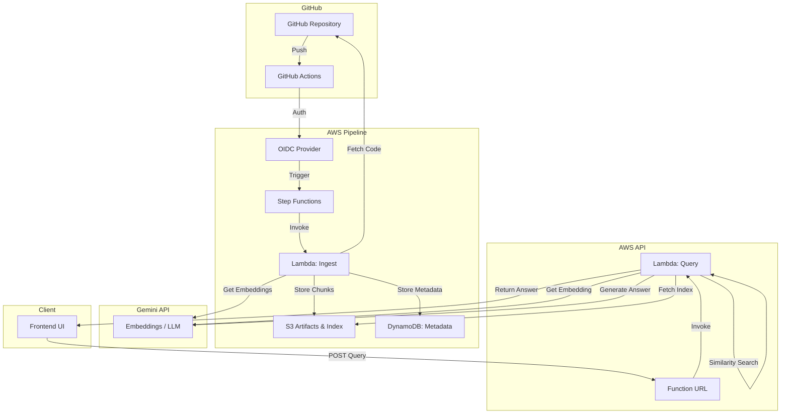

# Architecture

## 1. Overview
RepoMind is a cloud-native, serverless application deployed on AWS that provides Code-Aware Repository Q&A. It allows users to ask natural language questions about GitHub repositories. 

## 2. Architecture Diagram

## 3. Core Pipeline

### a. Ingestion Flow
1. Developer pushes to GitHub.
2. GitHub Actions workflows authenticate to AWS using OIDC.
3. Action triggers AWS Step Functions State Machine.
4. Step Functions invoke Ingestion Lambda (with Map state for parallelism).
5. Lambda retrieves code from GitHub API using a fine-grained PAT.
6. Tree-sitter parses the code into semantic chunks (functions, classes).
7. Chunks are sent to Gemini to generate vector embeddings.
8. Embeddings and chunk data are stored as per-file artifacts in S3.
9. Metadata and state are tracked in DynamoDB.
10. Post-Map, a consolidated NumPy index is rebuilt in S3.

### b. Query Flow
1. User enters a query on the frontend UI.
2. UI makes a POST request to the Lambda Function URL.
3. Query Lambda generates an embedding for the user's question via Gemini.
4. Lambda downloads the consolidated NumPy vector index from S3.
5. In-memory cosine similarity search (using NumPy) finds relevant chunks.
6. Relevant chunks are passed as context to the Gemini LLM.
7. Gemini generates a natural language answer with citations.
8. Answer and source references are returned to the user.

## 4. Public & Private Repository Support
- **GitHub OIDC:** Used strictly by GitHub Actions to securely authenticate to AWS without long-lived credentials. This allows Actions to trigger the Step Functions pipeline.
- **GitHub Token (PAT):** Used by the Ingestion Lambda to fetch repository contents via the GitHub API. This allows RepoMind to access both public and private repositories, as long as the token has read permissions.

## 5. Architecture Deviations from Synopsis

To ensure the project stays within the $0 target cost while remaining robust:

*   **SSM Parameter Store Standard (SecureString) INSTEAD OF Secrets Manager:**
    *   *Reason:* Secrets Manager has a fixed monthly cost per secret. SSM Parameter Store Standard is completely free and supports secure encryption via KMS.
*   **S3 + Serialized NumPy Vector Index INSTEAD OF Managed Vector DB (e.g., FAISS/Pinecone/Chroma):**
    *   *Reason:* Managed vector databases incur constant uptime costs. S3 is virtually free. For the scale of a single repository in a college project, downloading a serialized NumPy array from S3 into Lambda memory is extremely fast (milliseconds) and completely serverless.
*   **Lambda Function URL INSTEAD OF API Gateway:**
    *   *Reason:* API Gateway adds complexity and potential cost overhead. Function URLs provide a native, free HTTPS endpoint directly to the Lambda function, perfect for this demo.

## 6. Incremental Indexing
To avoid re-indexing the entire repository on every push, RepoMind implements incremental indexing:
- Analyzes the commit diff.
- Identifies Added, Modified, and Deleted files.
- Skips processing for unchanged files.
- Ingestion Map state only processes files that changed, updating their specific S3 artifacts.

## 7. Post-Map Index Rebuild
Because AWS Step Functions Map state executes concurrently, having workers write directly to a single global vector index creates race conditions. 
- *Solution:* Workers write *per-file* embedding artifacts to S3.
- After the Map state completes, a final Lambda function runs to merge all per-file artifacts into a single, consolidated NumPy index stored in S3, ready for rapid querying.

## 8. Code-Aware Chunking
Using `tree-sitter`, the ingestion pipeline creates semantic chunks rather than arbitrary line splits. It parses the Abstract Syntax Tree (AST) to identify logical boundaries like functions, classes, and methods, improving embedding quality and retrieval accuracy. A fallback line-based chunker handles unsupported languages.

## 9. Embedding Storage
Embeddings are generated via Google Gemini. They are serialized alongside their text payload and metadata, stored in an S3 bucket configured for the environment.

## 10. DynamoDB Schema
A single-table design manages metadata:
- **PK (Partition Key):** `REPO#owner/repo`
- **SK (Sort Key):** `FILE#path/to/file.ext` or `STATE#latest`
- Stores chunk mapping, commit SHAs, and pipeline execution state.
